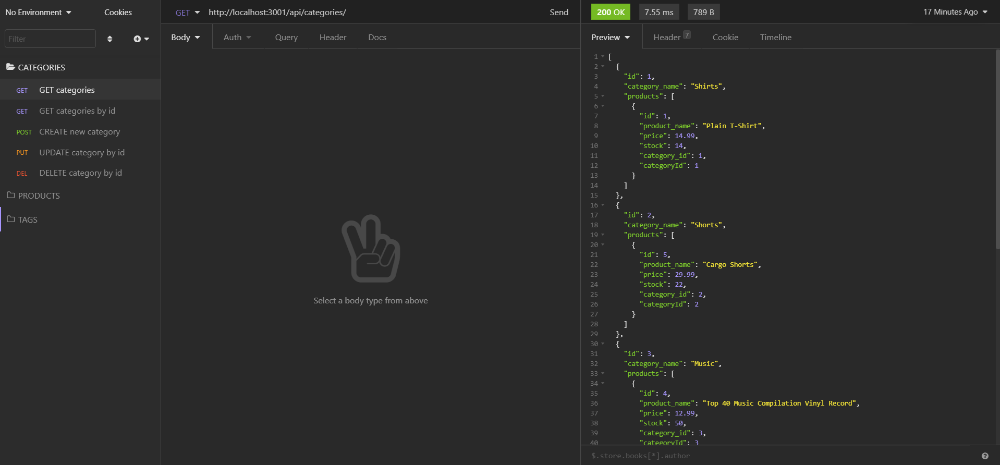
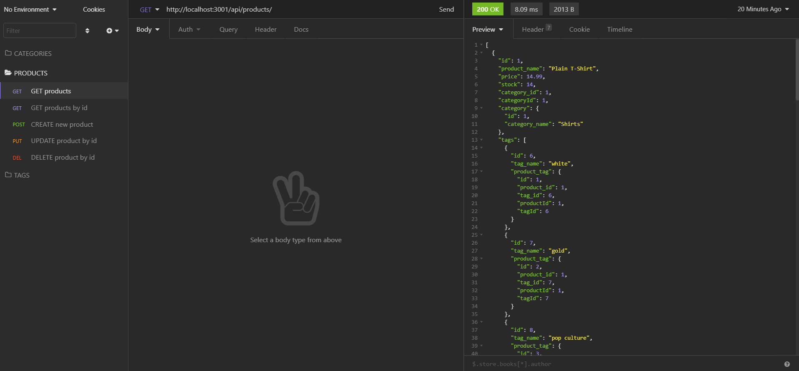
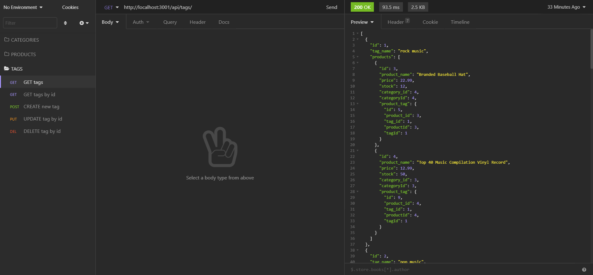

# 13 Object-Relational Mapping (ORM): E-Commerce Back End

## Description
Internet retail, also known as **e-commerce**, is the largest sector of the electronics industry, generating an estimated $29 trillion in 2019. E-commerce platforms like Shopify and WooCommerce provide a suite of services to businesses of all sizes. Due to their prevalence, understanding the fundamental architecture of these platforms will benefit us as a full-stack web developers.  

This server application is the back end for an e-commerce site. A configuration of a working Express.js API to use with Sequelize and to interact with a MySQL database.  

This application is using the following dependencies:
 - dotenv
 - express
 - mysql2
 - sequelize

## Table of Contents

* [Installation](#installation)

* [Screenshots](#screenshots)

* [Usage](#usage)

* [Demo](#demo)

* [Acknowledgements](#acknowledgements)

## Installation

Run dependencies:

```bash
npm i
```

For creating and using the same database structure:

```bash
mysql -u root -p < db/schema.sql
```

For pre-populating the database:

```bash
npm run seed
```

For starting the server application:

```bash
npm start
```

## Screenshots

In Insomnia Core, all requests in a directory folder CATEGORIES:



In Insomnia Core, all requests in a directory folder PRODUCTS:



In Insomnia Core, all requests in a directory folder TAGS:



## Usage

Referencing from the [screenshots](#screenshots) above, the user can access different routes using throught the use of Insomnia Core, different kinds of methods and urls are needed to send specific requests to the back end database:

**MAIN** routes: 

```bash
http://localhost:3001/api/categories

http://localhost:3001/api/products

http://localhost:3001/api/tags
```

**SUB** routes:

- Display all datas from the table inside the database
```bash
/
method: GET
```
 - Display a specific data, searched by id from the table inside the database
```bash
/:id
method: GET
```
 - Create a new data entry
```bash
/
method: POST
```
 - Update a data entry, by id
```bash
/:id
method: PUT
```
 - Delete a data entry, by id
```bash
/:id
method: DELETE
```
**FOR POST AND PUT methods**, this is the JSON format as object is needed for the Insomnia Core request body to be sent to the server:
```bash
{
    "category_name": "Dress"
}
main route: categories


{
    "product_name": "Basketball",
    "price": 200.00,
    "stock": 3,
    "tagIds": [1, 2, 3, 4]
}
main route: products


{
    "tag_name": "nerdy"
}
main route: tags
```

## Demo

https://drive.google.com/file/d/1Y5oQjCb3SfLG5LtAqdPPO83KgTOEImG8/view

## Acknowledgements
- Mr. John
- Mr. Luis
- Oliver Shih
- Mr. Faran, Navazi